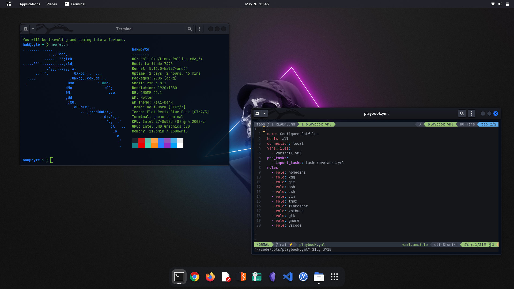

# Dotfiles

My Kali Linux dotfiles, powered by [Ansible](https://www.ansible.com/). Compared
to other solutions I previously used to manage dotfiles, Ansible is way more
flexible at the cost of *some* complexity ;)

> :memo: You may also want to check out my other [Ansible playbook](https://github.com/hakbyte/flame)
> for setting up Kali Linux. They are intended to complement each other.

So how does it look like?



# Usage

> :warning: **Important:**
> - To achieve similar results, install [Kali Linux](https://www.kali.org/)
> 2022.2 with Gnome as the Desktop Environment
> - Don't blindly run this playbook or your configuration files will be
> overwritten! If you're new to Ansible, run the playbook in a VM and copy the
> tidbits that interest you. Otherwise spend some time to learn how everything
> fits together and adapt it to your environment.

First install the dependencies:

```txt
$ sudo apt install ansible python3-psutil
```

Next clone this repo and run the playbook:

```
$ git clone https://github.com/hakbyte/dots.git
$ cd dots
$ ansible-playbook -i hosts playbook.yml -e target=<TARGET>
```

> :memo: Possible values for `<TARGET>` are `desktop` and `laptop`. The former
> is fine tuned for a smaller screen (1920x1080 pixels) besides configuring the
> touchpad.

It's also possible to run each Ansible role individually. If, let's say, you're
only interested in my Vim config:

```txt
$ ansible-playbook -i hosts playbook.yml -e target=<TARGET> -t vim
```

Beware that some roles have dependencies. Check the `meta/main.yml` file inside
each role to find out.

# Customization

Check both `vars/all.yml` and `vars/pretasks.yml` for ways of customizing this
setup.

# TODO

- [ ] Update homedirs role to only delete empty folders (see [remove empty dirs](https://www.reddit.com/r/ansible/comments/k9aqfq/remove_empty_dirs/))
- [ ] Change `.face` picture
- [x] Install [Emoji Selector](https://extensions.gnome.org/extension/1162/emoji-selector/)
- [ ] Change Zsh's root prompt to red
- [x] Add screenshot of current configuration
- [ ] Fix missing glyph in vim-airline
- [ ] Add *Features* section to `README.md`
- [ ] Fix: vim colors don't work inside Tmux
- [ ] Create GitHub issues for every TODO item
